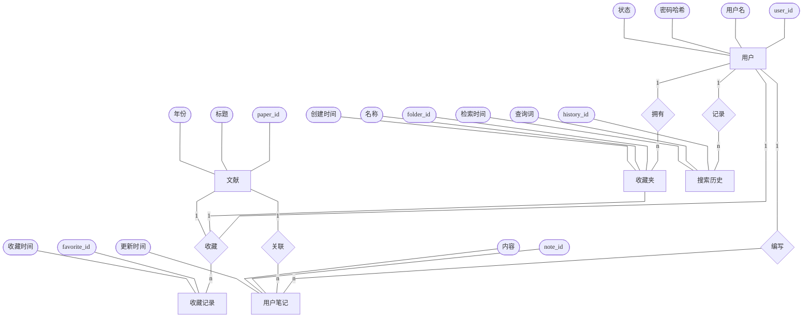
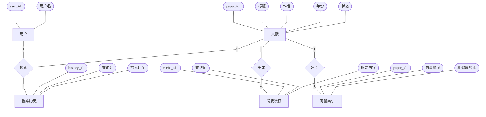
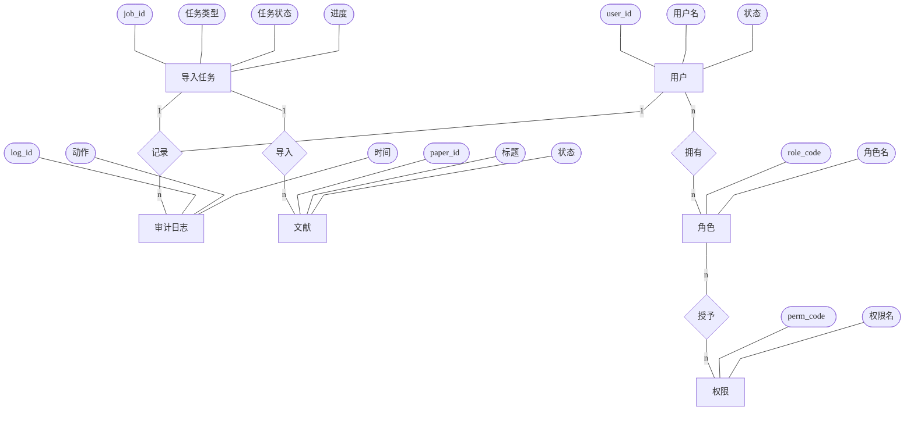

# 概念结构设计（E-R图）Mermaid 草图

为保证图面更清晰、整体更方正，建议将概念结构设计拆成 3 张小 E-R 图，分别对应用户侧个性化管理、文献检索与知识服务、后台管理与权限任务。

### 1. 用户侧个性化管理 E-R 图

#### 图名

图4.X 用户侧个性化管理概念结构设计图

#### Mermaid 草图



### 2. 文献检索与知识服务 E-R 图

#### 图名

图4.X 文献检索与知识服务概念结构设计图

#### Mermaid 草图



### 3. 后台管理与权限任务 E-R 图

#### 图名

图4.X 后台管理与权限任务概念结构设计图

#### Mermaid 草图


 


 ```mermaid
flowchart TB
  A[进入系统] --> B{选择操作}

  B -->|注册| C[填写注册信息]
  B -->|登录| D[填写账号密码]

  C --> E{信息是否合法}
  E -->|否| C1[提示并重新填写]
  C1 --> C
  E -->|是| F{用户名是否存在}
  F -->|是| F1[提示用户名已存在]
  F1 --> C
  F -->|否| G[创建用户]
  G --> H[注册成功]
  H --> D

  D --> I{账号密码是否正确}
  I -->|否| I1[提示登录失败]
  I1 --> D
  I -->|是| J[生成Token]
  J --> K[进入首页]

```