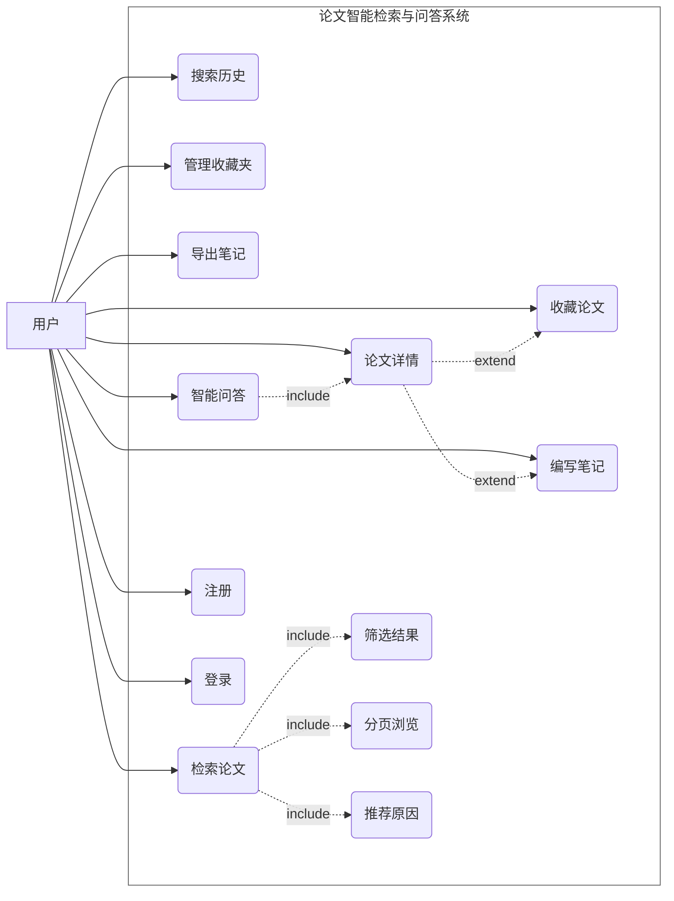
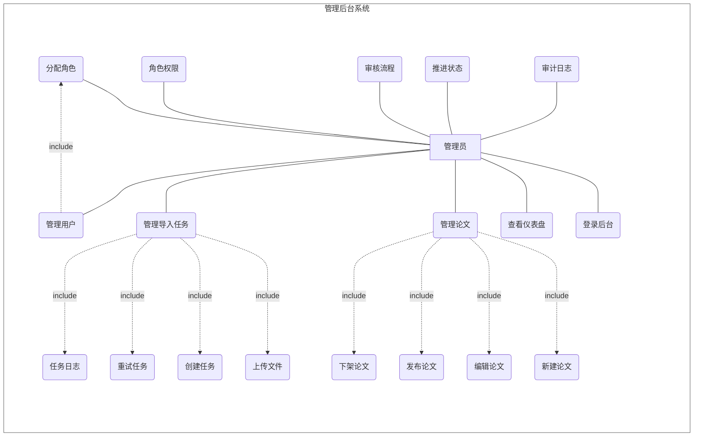
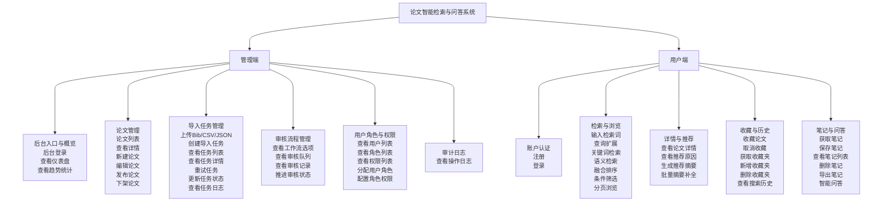
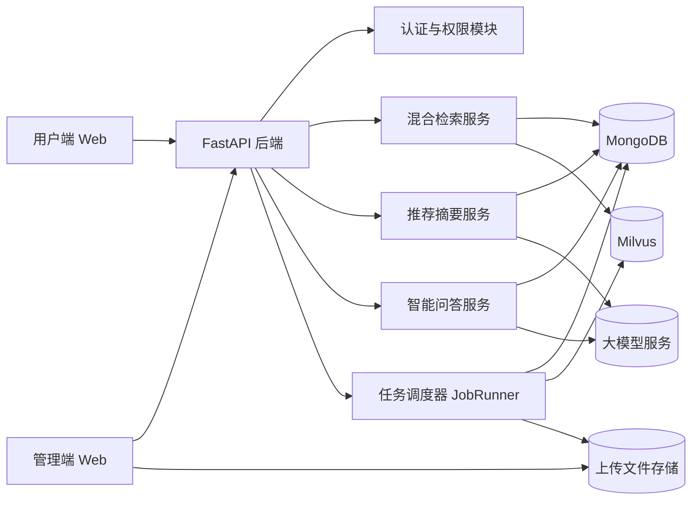
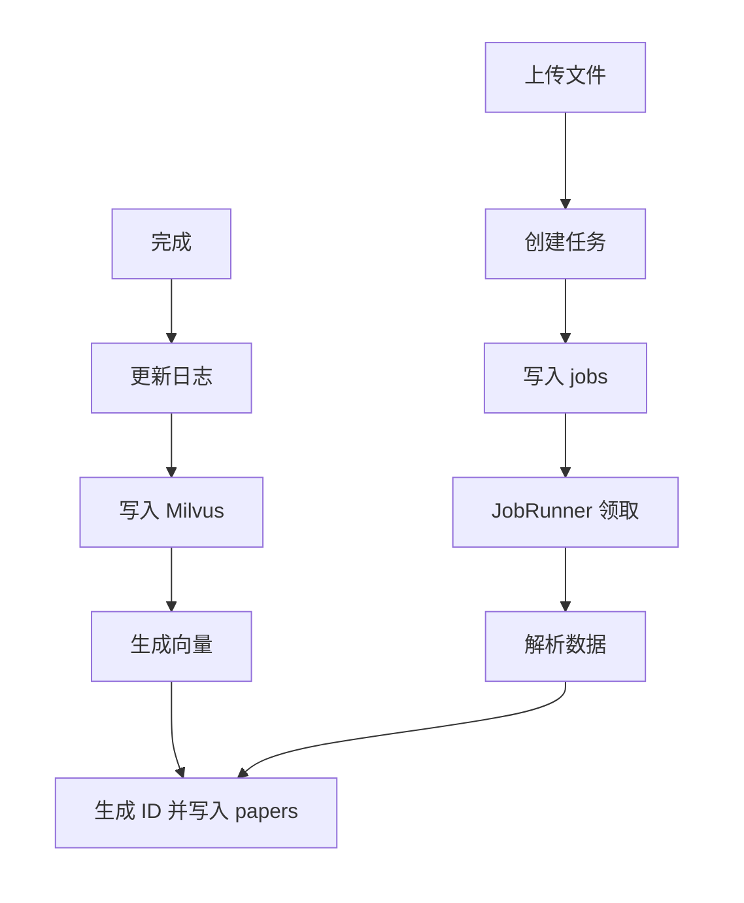
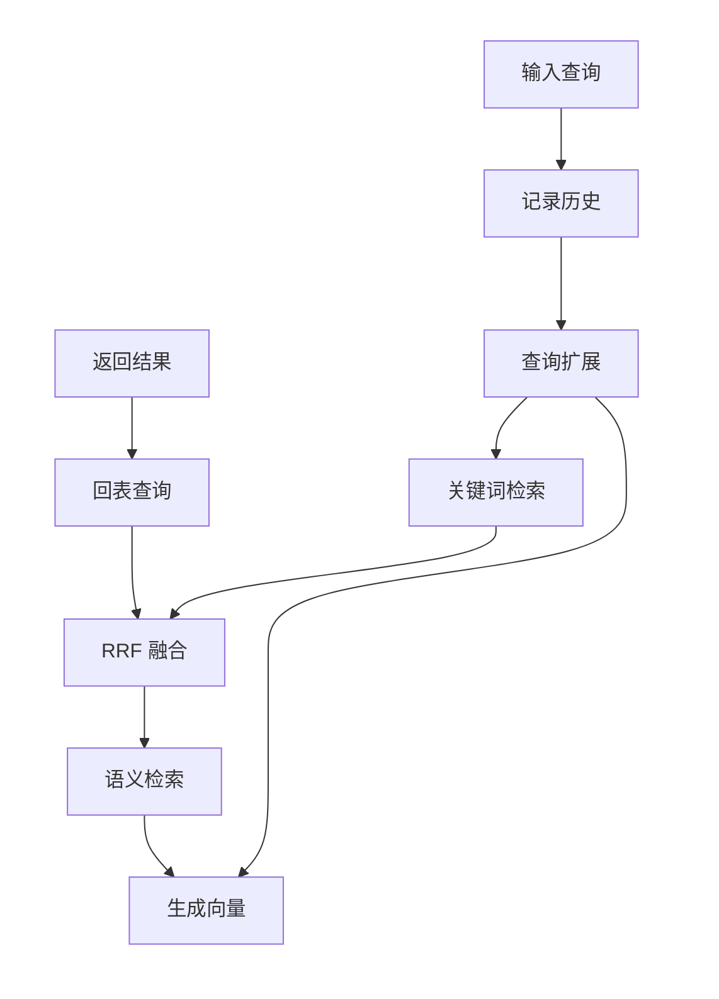
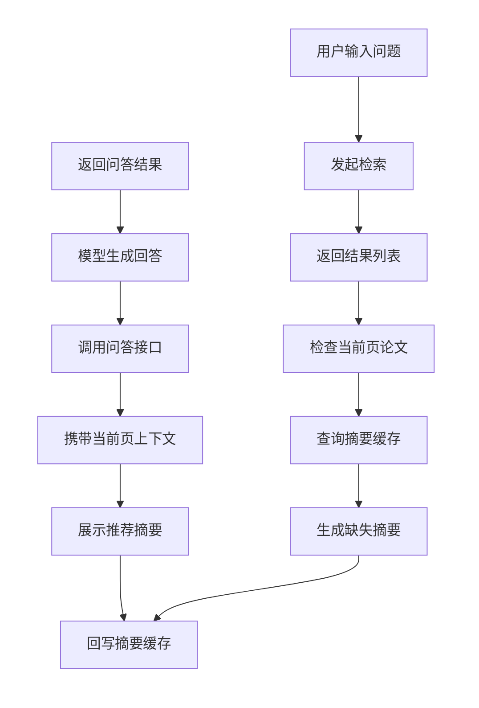
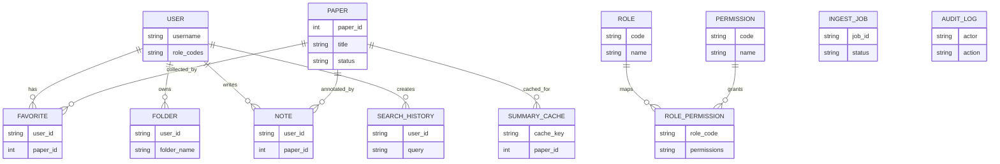
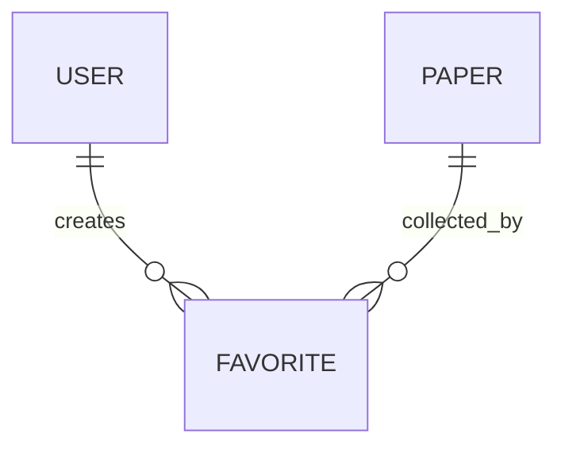

# 论文补图清单与草图规格

## 1. 结论先看

结合以下三类信息：

- 当前初稿 `毕业论文-初稿-刘涵(2).docx`
- 参考论文 `1 20212203236-刘玉霞-基于Django的在线农贸产品交易平台设计与实现.docx`
- 当前项目实际代码结构与功能模块

可以先得出两个判断：

1. 当前初稿里已经明确留空、必须补上的图，至少有 2 张：
   - 图3.2.1 用户用例图
   - 图3.2.2 管理员用例图
2. 如果希望论文第 4 章更完整，建议继续补 6 张设计类图：
   - 功能结构图
   - 系统总体架构图
   - 数据导入与索引构建流程图
   - 混合检索与排序流程图
   - 智能问答与推荐摘要流程图
   - 核心数据实体关系图

如果你只想先把最急的缺口补上，优先级建议如下：

1. 图3.2.1 用户用例图
2. 图3.2.2 管理员用例图
3. 功能结构图
4. 系统总体架构图
5. 智能问答与推荐摘要流程图
6. 数据导入与索引构建流程图
7. 混合检索与排序流程图
8. 核心数据实体关系图

## 2. 参考论文能借鉴什么

参考论文里可以明确确认到两类图像思路：

- 第 4 章有结构型图：`图4.15 系统E-R图`
- 第 5 章大量使用实现截图：如用户注册、登录、首页、分类页、详情页、后台管理页等

因此对你这篇论文来说，最稳妥的借鉴方式不是机械照搬截图数量，而是沿用它的章节节奏：

- 第 3 章补需求分析图：用例图
- 第 4 章补设计图：功能结构图、架构图、流程图、E-R 图
- 第 5 章如果后面还需要扩写，可再补功能页面截图

## 3. 必补图

### 3.1 图3.2.1 用户用例图

#### 图名

图3.2.1 用户用例图

#### 适合放置的位置

第 3 章 `3.2.1 用户端功能需求`

#### 参与者

- 用户

#### 用例节点

- 注册
- 登录
- 检索论文
- 筛选结果
- 分页浏览
- 查看论文详情
- 查看推荐原因
- 收藏论文
- 管理收藏夹
- 查看搜索历史
- 编写笔记
- 导出笔记
- 智能问答

#### 主要连线关系

- 用户 -> 注册
- 用户 -> 登录
- 用户 -> 检索论文
- 用户 -> 筛选结果
- 用户 -> 分页浏览
- 用户 -> 查看论文详情
- 用户 -> 收藏论文
- 用户 -> 管理收藏夹
- 用户 -> 查看搜索历史
- 用户 -> 编写笔记
- 用户 -> 导出笔记
- 用户 -> 智能问答
- 检索论文 ..> 筛选结果 : <<include>>
- 检索论文 ..> 分页浏览 : <<include>>
- 检索论文 ..> 查看推荐原因 : <<include>>
- 查看论文详情 ..> 编写笔记 : <<extend>>
- 查看论文详情 ..> 收藏论文 : <<extend>>
- 智能问答 ..> 查看论文详情 : <<include>>

#### 布局建议

- 整体采用横向展开，优先占满页面宽度
- 左侧只放 1 个参与者“用户”
- 中间放系统边界框，标题写“论文智能检索与问答系统”
- 系统框内分成上下两排，控制整体高度
- 上排放“注册、登录、检索论文、筛选结果、分页浏览、推荐原因”
- 下排放“搜索历史、论文详情、收藏论文、管理收藏夹、编写笔记、导出笔记、智能问答”
- 系统框仅保留边框，不使用黄色底，便于放入 Word 表格

#### Mermaid 草图

### 3.2 图3.2.2 管理员用例图

#### 图名

图3.2.2 管理员用例图

#### 适合放置的位置

第 3 章 `3.2.2 管理端功能需求`

#### 参与者

- 管理员

#### 用例节点

- 登录后台
- 查看仪表盘
- 管理论文
- 新建论文
- 编辑论文
- 发布论文
- 下架论文
- 管理导入任务
- 上传导入文件
- 创建任务
- 重试任务
- 查看任务日志
- 管理用户
- 分配角色
- 配置角色权限
- 查看审核流程
- 推进审核状态
- 查看审计日志

#### 主要连线关系

- 管理员 -> 登录后台
- 管理员 -> 查看仪表盘
- 管理员 -> 管理论文
- 管理员 -> 管理导入任务
- 管理员 -> 管理用户
- 管理员 -> 配置角色权限
- 管理员 -> 查看审核流程
- 管理员 -> 推进审核状态
- 管理员 -> 查看审计日志
- 管理论文 ..> 新建论文 : <<include>>
- 管理论文 ..> 编辑论文 : <<include>>
- 管理论文 ..> 发布论文 : <<include>>
- 管理论文 ..> 下架论文 : <<include>>
- 管理导入任务 ..> 上传导入文件 : <<include>>
- 管理导入任务 ..> 创建任务 : <<include>>
- 管理导入任务 ..> 重试任务 : <<include>>
- 管理导入任务 ..> 查看任务日志 : <<include>>
- 管理用户 ..> 分配角色 : <<include>>

#### 布局建议

- 整体采用横向展开，减少纵向堆叠
- 第一排让管理员居中，左右两侧展开主要功能
- 左侧放“分配角色、角色权限、审核流程、推进状态、审计日志”
- 右侧放“登录后台、查看仪表盘、管理论文、管理导入任务、管理用户”
- 第二排单独放“论文管理子功能”和“导入任务子功能”，避免图形过高
- 系统框仅保留边框，不使用黄色底，更适合放进 Word 表格

#### Mermaid 草图

## 4. 建议新增图

### 4.1 功能结构图

#### 建议图名

图4.X 功能结构图

#### 适合放置的位置

第 4 章 `4.1 系统总体设计` 或 `4.1 功能模块设计`

#### 核心节点

- 论文智能检索与问答系统
- 用户端
- 管理端
- 账户认证
- 检索与浏览
- 详情与推荐
- 收藏与历史
- 笔记与问答
- 后台入口与概览
- 论文管理
- 导入任务管理
- 审核流程管理
- 用户角色与权限
- 审计日志

#### 连线关系

- 论文智能检索与问答系统 -> 用户端
- 论文智能检索与问答系统 -> 管理端
- 用户端 -> 账户认证
- 用户端 -> 检索与浏览
- 用户端 -> 详情与推荐
- 用户端 -> 收藏与历史
- 用户端 -> 笔记与问答
- 管理端 -> 后台入口与概览
- 管理端 -> 论文管理
- 管理端 -> 导入任务管理
- 管理端 -> 审核流程管理
- 管理端 -> 用户角色与权限
- 管理端 -> 审计日志

#### 布局建议

- 采用自上而下的三级树形结构，整体更方正
- 顶部只保留 1 个总节点“论文智能检索与问答系统”
- 第二层只保留“用户端”和“管理端”两个一级分支
- 第三层在两个分支下分别列出详细功能块，并在节点内写出全部子功能
- 第三层节点使用多行换行写法，优先压缩宽度而不是继续横向展开
- 用户端和管理端各自纵向排布，保证整体不至于过宽
- 所有分组使用透明底色，只保留普通节点，不出现黄色底块

#### Mermaid 草图

### 4.2 系统总体架构图

#### 建议图名

图4.X 系统总体架构图

#### 适合放置的位置

第 4 章 `4.1 系统总体架构设计`

#### 核心节点

- 用户端 Web
- 管理端 Web
- FastAPI 后端
- 认证与权限模块
- 检索服务
- 推荐摘要服务
- 智能问答服务
- 任务调度器 JobRunner
- MongoDB
- Milvus
- 上传文件存储
- 大模型服务

#### 连线关系

- 用户端 Web -> FastAPI 后端
- 管理端 Web -> FastAPI 后端
- FastAPI 后端 -> 认证与权限模块
- FastAPI 后端 -> 检索服务
- FastAPI 后端 -> 推荐摘要服务
- FastAPI 后端 -> 智能问答服务
- FastAPI 后端 -> 任务调度器 JobRunner
- 检索服务 -> MongoDB
- 检索服务 -> Milvus
- 推荐摘要服务 -> MongoDB
- 推荐摘要服务 -> 大模型服务
- 智能问答服务 -> MongoDB
- 智能问答服务 -> 大模型服务
- 任务调度器 JobRunner -> MongoDB
- 任务调度器 JobRunner -> Milvus
- 管理端 Web -> 上传文件存储

#### 布局建议

- 改为从左到右分 4 列，更适合 Word 表格横向放置
- 第 1 列：用户端 Web、管理端 Web
- 第 2 列：FastAPI 后端
- 第 3 列：认证与权限、检索服务、推荐摘要、智能问答、JobRunner
- 第 4 列：MongoDB、Milvus、上传文件存储、大模型服务

#### Mermaid 草图

### 4.3 数据导入与索引构建流程图

#### 建议图名

图4.X 数据导入与索引构建流程图

#### 适合放置的位置

第 4 章 `4.2.1 数据导入与索引构建流程`

#### 核心节点

- 管理员上传文件
- 创建导入任务
- 写入 ingest_jobs
- JobRunner 轮询任务
- 解析 Bib/CSV/JSON
- 生成 paper_id 并写入 papers
- 生成向量嵌入
- 写入 Milvus
- 更新任务状态与日志
- 任务完成

#### 连线关系

- 管理员上传文件 -> 创建导入任务
- 创建导入任务 -> 写入 ingest_jobs
- 写入 ingest_jobs -> JobRunner 轮询任务
- JobRunner 轮询任务 -> 解析 Bib/CSV/JSON
- 解析 Bib/CSV/JSON -> 生成 paper_id 并写入 papers
- 生成 paper_id 并写入 papers -> 生成向量嵌入
- 生成向量嵌入 -> 写入 Milvus
- 写入 Milvus -> 更新任务状态与日志
- 更新任务状态与日志 -> 任务完成

#### 布局建议

- 采用两行蛇形单线流程，整体尽量接近方正
- 第一行保留“上传文件”到“解析数据”
- 第二行从右向左继续，放“生成 ID 并写入 papers”到“任务完成”
- 不使用判断分支，整张图只保留一条主流程线
- 使用透明分组，只用于排版，不显示有色底块

#### Mermaid 草图

### 4.4 混合检索与排序流程图

#### 建议图名

图4.X 混合检索与排序流程图

#### 适合放置的位置

第 4 章 `4.2.2 混合检索与排序流程`

#### 核心节点

- 用户输入查询
- 记录搜索历史
- 查询扩展
- 生成查询向量
- Milvus 语义检索
- BM25 关键词检索
- RRF 融合排序
- 回表查询 papers
- 返回结果列表

#### 连线关系

- 用户输入查询 -> 记录搜索历史
- 记录搜索历史 -> 查询扩展
- 查询扩展 -> 生成查询向量
- 查询扩展 -> BM25 关键词检索
- 生成查询向量 -> Milvus 语义检索
- Milvus 语义检索 -> RRF 融合排序
- BM25 关键词检索 -> RRF 融合排序
- RRF 融合排序 -> 回表查询 papers
- 回表查询 papers -> 返回结果列表

#### 布局建议

- 采用两层排布，整体尽量接近方形
- 第一层放“输入查询、记录历史、查询扩展、关键词检索”
- 第二层从右向左放“生成向量、语义检索、RRF 融合、回表查询、返回结果”
- 保留“双路召回”语义，但减少单行宽度
- 使用透明分组，只用于排版，不显示底色

#### Mermaid 草图

### 4.5 智能问答与推荐摘要流程图

#### 建议图名

图4.X 智能问答与推荐摘要流程图

#### 适合放置的位置

第 4 章 `4.2.3 智能问答与推荐摘要流程`

#### 核心节点

- 用户输入问题
- 发起检索
- 返回结果列表
- 检查当前页论文
- 查询摘要缓存
- 生成缺失摘要
- 回写摘要缓存
- 展示推荐摘要
- 用户输入问题
- 携带当前页上下文
- 调用问答接口
- 大模型生成回答
- 返回问答结果

#### 连线关系

- 用户输入问题 -> 发起检索
- 发起检索 -> 返回结果列表
- 返回结果列表 -> 检查当前页论文
- 检查当前页论文 -> 查询摘要缓存
- 查询摘要缓存 -> 生成缺失摘要
- 生成缺失摘要 -> 回写摘要缓存
- 回写摘要缓存 -> 展示推荐摘要
- 展示推荐摘要 -> 携带当前页上下文
- 携带当前页上下文 -> 调用问答接口
- 调用问答接口 -> 大模型生成回答
- 大模型生成回答 -> 返回问答结果

#### 布局建议

- 采用两行蛇形单线流程，整体尽量接近方形
- 第一行放“用户输入问题”到“生成缺失摘要”
- 第二行从右向左放“回写摘要缓存”到“返回问答结果”
- 用一条主流程线表达“问题先触发检索，再生成推荐摘要，最后进入问答”
- 使用透明分组，只用于排版，不显示底色

#### Mermaid 草图

### 4.6 核心数据实体关系图

#### 建议图名

图4.X 核心数据实体关系图

#### 适合放置的位置

第 4 章 `4.3 数据存储设计`

#### 建议保留的核心实体

- User
- Paper
- Favorite
- Folder
- Note
- SearchHistory
- SummaryCache
- IngestJob
- AuditLog
- Role
- Permission
- RolePermission

#### 关键字段建议

- User: username, role_codes
- Paper: paper_id, title, status
- Favorite: user_id, paper_id
- Folder: user_id, folder_name
- Note: user_id, paper_id
- SearchHistory: user_id, query
- SummaryCache: cache_key, paper_id
- IngestJob: job_id, status
- AuditLog: actor, action
- Role: code, name
- Permission: code, name
- RolePermission: role_code, permissions

#### 关系建议

- User 与 Favorite: 1 对多
- User 与 Folder: 1 对多
- User 与 Note: 1 对多
- User 与 SearchHistory: 1 对多
- Paper 与 Favorite: 1 对多
- Paper 与 Note: 1 对多
- Paper 与 SummaryCache: 1 对多
- Role 与 RolePermission: 1 对 1 或 1 对多
- Permission 与 RolePermission: 多对多映射

#### 布局建议

- 中间放 Paper
- 左侧放 User 相关实体：Favorite、Folder、Note、SearchHistory
- 右侧放后台实体：IngestJob、AuditLog、Role、Permission、RolePermission
- SummaryCache 放在 Paper 下方

#### Mermaid 草图

## 6. 可选增强图

下面两张图不是当前最急，但如果你准备把第 4 章写得更扎实，可以继续补：

### 6.1 审核状态流转图

- 建议图名：论文审核状态流转图
- 节点：submitted, initial_review, peer_review, revision_required, accepted, rejected, published
- 适合工具：Mermaid `stateDiagram-v2`
- 最适合放在：管理员审核流程或权限模型说明附近

### 6.2 角色权限关系图

- 建议图名：角色-权限分配关系图
- 节点：admin, editor, user, paper:view, paper:create, job:view, review:manage 等
- 适合工具：Mermaid flowchart 或 draw.io
- 最适合放在：管理员功能设计或权限控制设计附近

## 7. 直接落地建议

如果你现在就开始画，建议按这个顺序操作：

1. 先用 Mermaid 生成 `图3.2.1 用户用例图`
2. 再用 Mermaid 生成 `图3.2.2 管理员用例图`
3. 用 Mermaid 生成 `功能结构图`
4. 用 Mermaid 生成 `系统总体架构图`
5. 用 Mermaid 生成 `数据导入与索引构建流程图`
6. 用 Mermaid 生成 `混合检索与排序流程图`
7. 用 Mermaid 生成 `智能问答与推荐摘要流程图`
8. 用 Mermaid `erDiagram` 生成 `核心数据实体关系图`

如果学校更偏向统一风格：

- 用例图也直接用 Mermaid，保持全篇草图工具一致
- 流程图和架构图可以转到 draw.io / ProcessOn 手工美化
- E-R 图可以先用 Mermaid 出草图，再在 draw.io 重绘为论文风格

## 8. 编号建议

你当前正文已经出现：

- 图3.2.1 用户用例图
- 图3.2.2 管理员用例图

后续新增图建议按章连续编号，不一定继续用三级编号。比较稳妥的两种写法如下：

- 写法 A：图4.1、图4.2、图4.3、图4.4、图4.5、图4.6
- 写法 B：图4.1.1、图4.1.2、图4.2.1、图4.2.2、图4.2.3、图4.3.1

如果学校模板没有强制要求，建议第 4 章统一成：

- 图4.1 功能结构图
- 图4.2 系统总体架构图
- 图4.3 数据导入与索引构建流程图
- 图4.4 混合检索与排序流程图
- 图4.5 智能问答与推荐摘要流程图
- 图4.6 核心数据实体关系图

## 9. E-R 图字号调整

如果你只想放大 E-R 图连线上的文字，而不明显放大实体框里的文字，可以优先尝试下面这种 `themeCSS` 写法：

如果平台对上面的选择器不生效，可以改用下面这版：

说明：

- `font-size: 24px` 控制的是连线关系标签的字号
- `relationshipLabel` 是 Mermaid E-R 图里关系文字常见的样式类名
- 如果仍不生效，说明当前平台对 Mermaid 的 CSS 覆盖支持有限，此时只能通过整体 `fontSize` 一起放大
